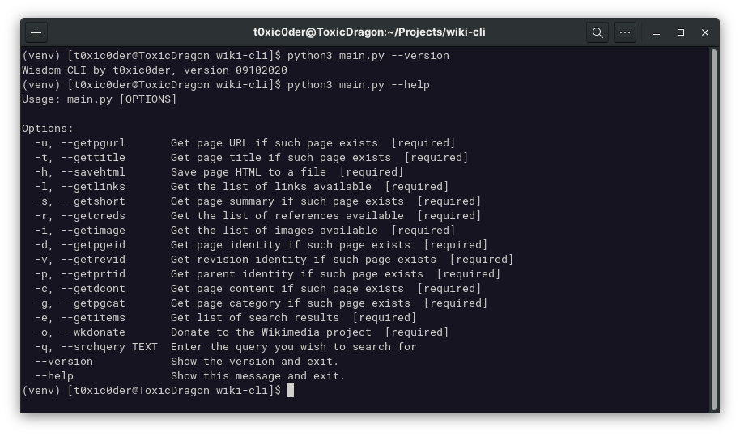
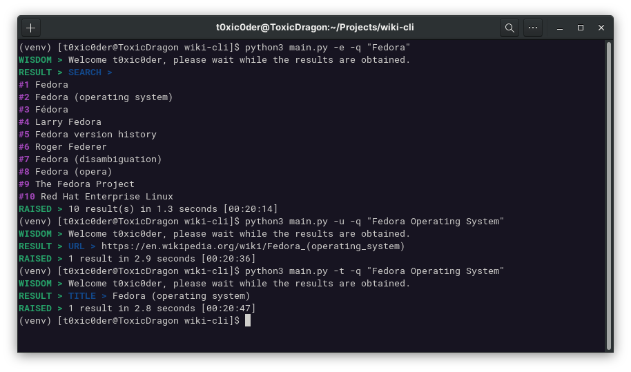
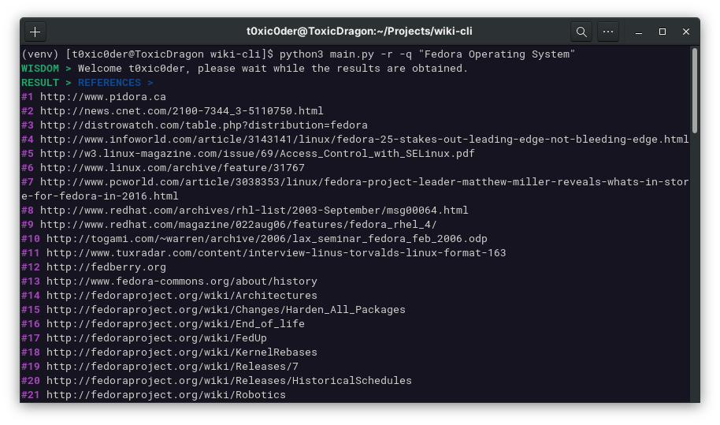
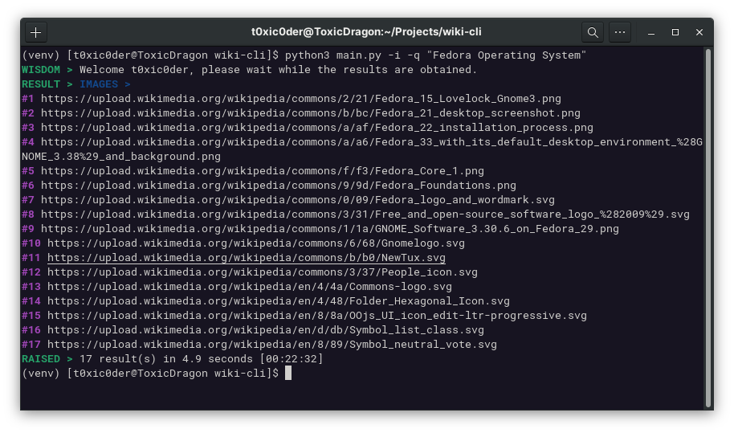
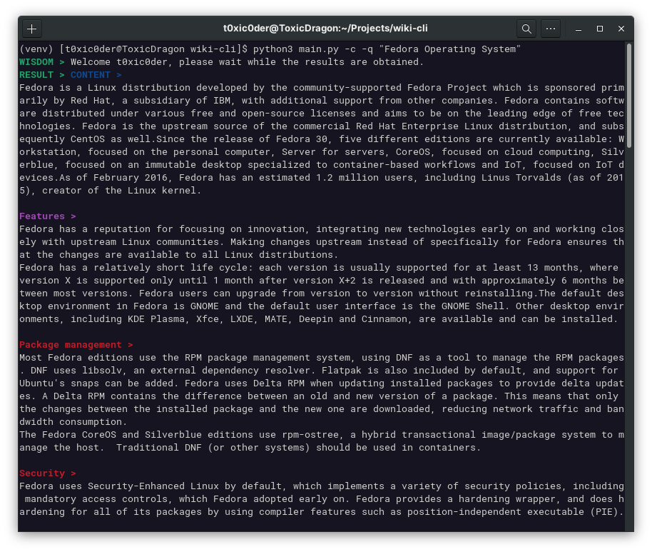

<h1 align="center">wisdom-cli</h1>

A convenient command-line bound implementation to use Wikipedia

    
    
    
    

## Screenshots

- An exhaustive set of features at your disposal

- Search for an item, figure its URL and then see its title

- Go through the list of references that your article has

- All image resources are available conveniently

- Read the complete content for the topic of your choice

